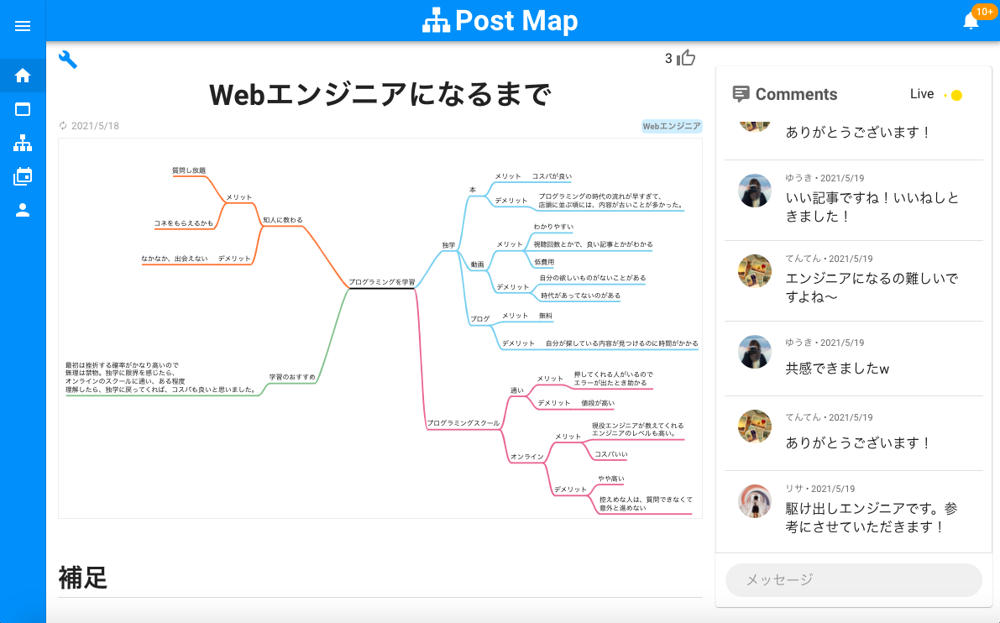
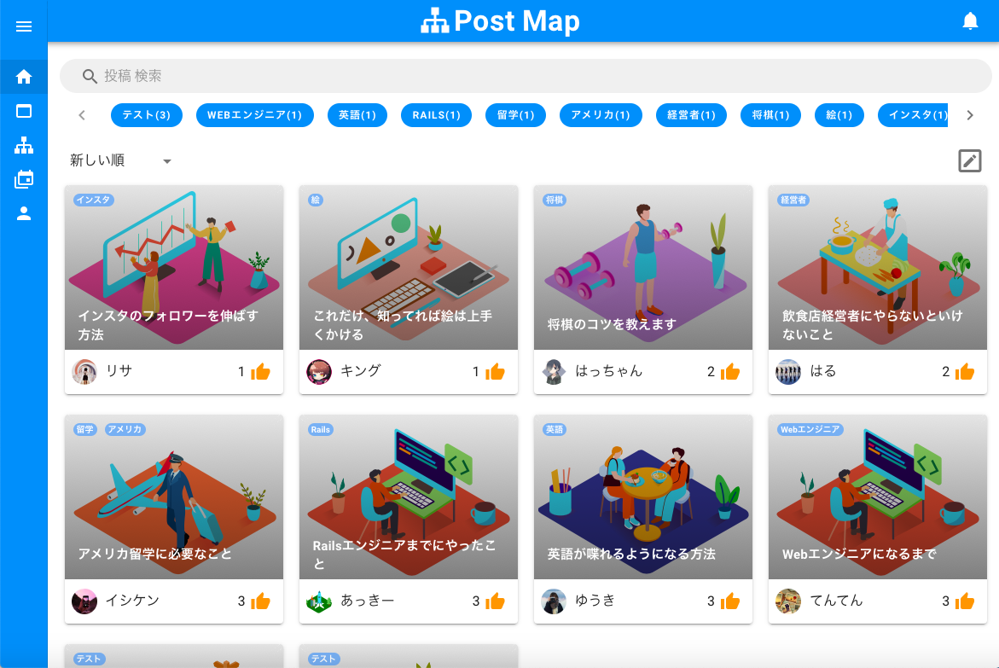
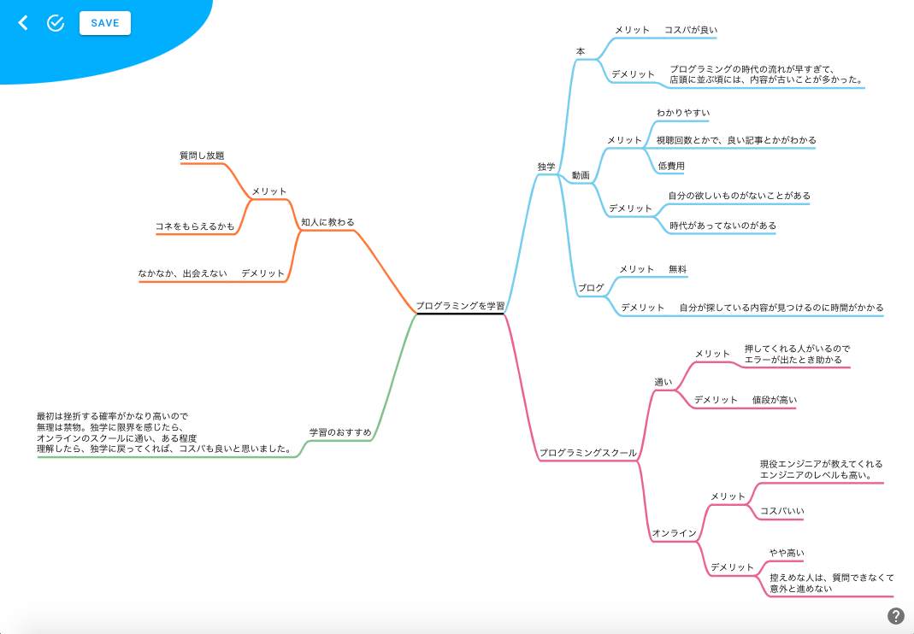

# Post Map 
[URL]　http://postmap.click

- 投稿した記事

- 投稿一覧

- マインドマップ作成

## アプリについて(概要)
「Post Map」は、Mindmapアプリの一つです。
目標達成、思考整理等のためにお使いください。

そこで、お願いがあります。  

あなたの
- 目標達成のために活用したマインドマップ
- 成功を可視化したマインドマップ  

を他の方にも共有していただけませんか？  

同じ目標を持った人の助けになります。  

マインドマップ + 投稿　＝　「成功の地図 (Post Map)」  

他人の意見を参考にし、最速で理想の自分を実現しましょう！

## なぜ、このアプリを作ったのか？
現在、この不安定な世の中で、成功をしたいと望んでる人が沢山います。
私は、YoutubeやGoogle検索、SNSを観察している中で、ある一つの発見がありました。
それは、成功する方法ではなく「成功者になるまでのプロセスにも需要があること」に気がつきました。
成功する方法は、情報が沢山出回っており、どれをピックアップしていいのか、すごく迷ってしまいます。
また、詳細な情報ではなく、抽象的情報が多く、成功のイメージが浮かばなかったり、途中で挫折してしまったりします。
さらに、日本人は慎重な性格なので、より詳細な情報を欲しがっていると感じました。
現に、Youtubeの再生数を見た時、「モーニングルーティーン」「現在までの経験談」など、その人のライフスタイルにも需要があったりします。
つまり、成功者のプロセスや、生き方に興味があり、よりRealを追求していることがわかりました。
そこで、具体的かつ、見やすいマインドマップのアプリを作成することにしました。
普段は、普通にマインドマップを活用していただき、目標達成できた時、投稿していただければ、詳細な意見を、同じ目標を持った人に届けられる思ったからです。
また、投稿時に意見をもらえるコメント機能がついているので、より前向きなものになると思いました。

## 使用技術
- Ruby 2.7.2 Rails 6.1.3
- Nuxt(Vue.js)
- Vuetify
- Docker/docker-compose
- Nginx, Unicorn(sockets通信)
- Git, GitHub
- Rubocop
- AWS (VPC, EC2, Route53)

## 機能一覧
### rails
- ログイン機能(devise token auth)
- 画像投稿機能(carrierwave)
- CRUD機能
- ページネーション機能(kaminari)
- いいね機能
- タグ機能
- コメント機能(Websocket)
- フォロー機能
- 通知機能(Websocket)
- 検索機能
- テストデータ投入(faker/gimei)
- API化(rack-cors)
- 構文規約チェックツール(rubocop)

## 開発において意識した事
- レスポンスの高速化。
- 無駄な思考をしないよう、シンプルかつ色の統一を意識しました。
- しっかり現状把握を行い、需要があり、被りがないものを作ろうと努めました。
